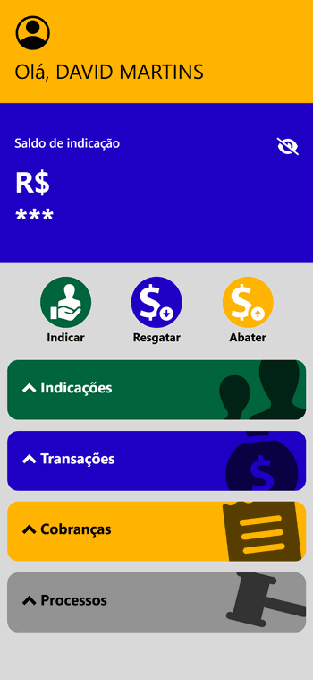
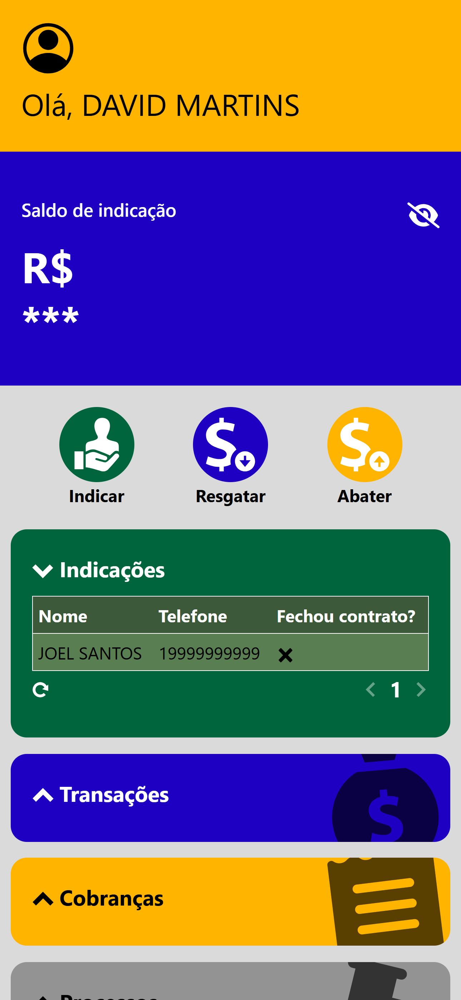
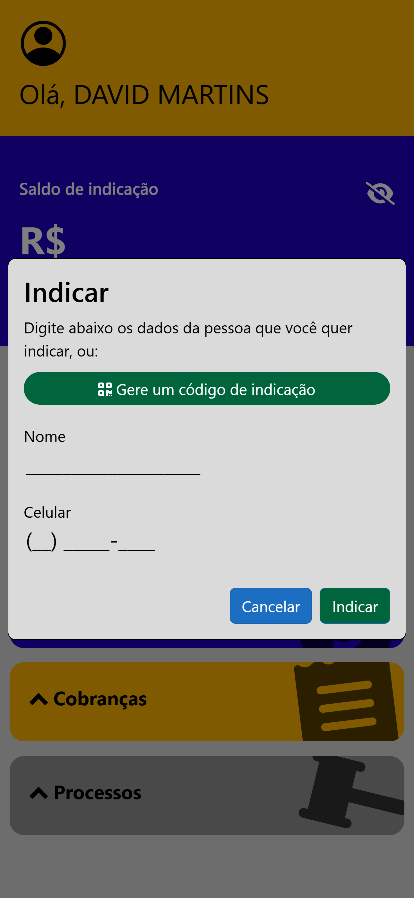
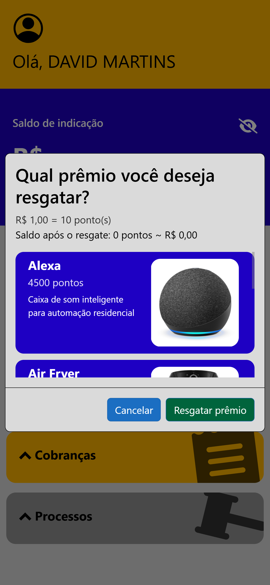
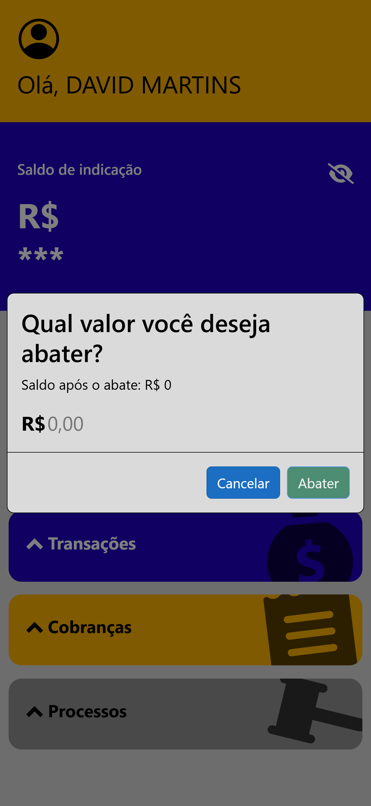

#  Indica+

## Descrição do projeto
**Indica+** é uma plataforma web desenvolvida com o objetivo de funcionar como uma **carteira digital de indicações**. Empresas podem utilizá-la para incentivar seus próprios clientes fidelizados a indicarem novos clientes, oferecendo recompensas em troca de indicações que resultem em serviços ou contratos fechados.

Cada empresa possui sua própria instância personalizada do sistema (multi-tenant), podendo administrar suas indicações, clientes, recompensas e — no caso de empresas jurídicas — também o andamento de processos jurídicos vinculados ao cliente.

## Funcionalidades
- 🤝 Indicação de novos clientes por usuários cadastrados;
- 💰 Acúmulo de saldo a cada indicação convertida em contrato;
- 🎁 Resgate de prêmios ou abatimento de boletos usando o saldo acumulado;
- 🧩 Suporte a múltiplas empresas (multi-tenant), com customização individual;
- 👥 Gestão de clientes e carteira de indicações pelas empresas;
- ⚖️ Módulo de acompanhamento de processos jurídicos (para empresas do setor jurídico).

## Caso de uso real
A primeira empresa a adotar a plataforma foi o escritório [LMR Advogados Associados](https://lmradvogados.com.br), que utiliza o sistema com o nome **Indica LMR**.

🔗 Acesse a instância personalizada da LMR [aqui](https://lmradvogados.lmradvogados.com.br).

### Demonstração

📷 Capturas de tela

#### Página inicial

#### Lista de indicações aberta

#### Modal de indicação aberto

#### Modal de resgate de prêmio aberto

#### Modal de abate de parcelas aberto

## Desenvolvimento
### Tecnologias utilizadas
- **Backend**: ASP.NET Core 8;
- **Frontend**: React;
- **Banco de dados**: MySQL, Entity Framework;

### Produção
A aplicação está disponível no endereço [https://indicamais.azurewebsites.net/](https://indicamais.azurewebsites.net/).

## Licença
Este projeto é de propriedade privada e não está disponível para modificação ou distribuição.

## Autor
- David Martins - [@davidmrtns](https://github.com/davidmrtns/)
